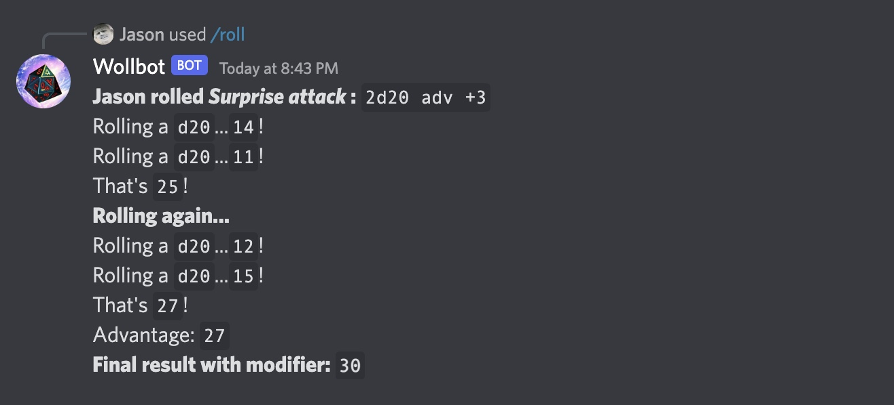

# Wollbot

My friend needed a dice roller for discord d&d.  
He's a pretty great friend, so I made him one.

## Features

- Rolling an any-sided die an arbitrary number of times
- Combining multiple dice in one roll
- Rolling a CURSED die
- Advantage / Disadvantage
- Modifiers
- "Titling" a roll so you know what it was for.



## Notes

Built for deployment on [Cloudflare Workers](https://workers.cloudflare.com/)

Followed this setup:
https://discord.com/developers/docs/tutorials/hosting-on-cloudflare-workers

And copied things from this example repo:
https://github.com/discord/cloudflare-sample-app

## Manual

```
Will's Rollbot
==============

    USAGE   Performs rolls as defined by the input text.
    PARAMS  A string of space-separated arguments.
    ------- ------------------------------------------------------------------
    ARGS    cursed  - A cursed roll. Will ignore 'd-rolls' if present.
            #d#     - A roll where the first # is the number of times and
                      the second # is the number of sides. Eg: 2d20
                      Will not work with in 'cursed-rolls'.
            adv     - Plays the given rolls a second time and takes the maximum.
            dis     - Plays the given rolls a second time and takes the minimum.
            -#      - A negative modifier. Eg: -3
            +#      - A positive modifier. Eg: +3
            for:"x" - Give a title to the roll. Title must be in double quotes.
            help    - Shows this manual.
    ------- ------------------------------------------------------------------
    NOTES   The order of the arguments doesn't matter.
            If multiple modifiers are present, only the first will be used.
            Will return an error if both 'adv' and 'dis' are provided.
            Modifiers can also be appended to d-rolls: 2d10+3
    EXAMPLE /roll d20 -3
            /roll 2d10 adv +4
            /roll +10 cursed
            /roll dis 2d27 -2 3d101
            /roll 4d4+2 for:"Perception check" adv
```

## Development

- Run `register` first if there are new/edited command names.
- Get a forwarding url with `npm run ngrok`
- Run `npm run dev`
- Save the ngrok url into the Bot application's INTERACTIONS ENDPOINT URL (in Settings)
- When finished `npm run publish` to deploy changes to Cloudflare.
- Don't forget to change the Bot's INTERACTIONS ENDPOINT URL back workers URL.
